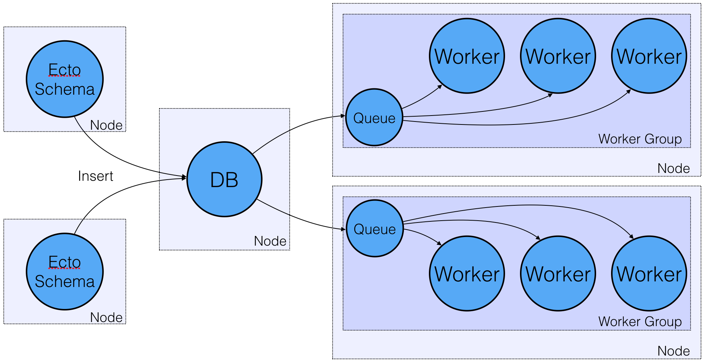

# Ecto Poll Queue


The Ecto Poll Queue is designed for jobs that need to be run every time you insert a new row into your database. For example, if a user uploads a song file, and you want to transcode it into a number of different formats, or if a user uploads a photo and you want to run your object classifier against it.

With this queue type, your database is the sole point of coordination, so any availability and replication guarantees are now shared by Honeydew. As such, all your nodes are independent, and don't need to be connected via distributed erlang, as they would with a normal `:global` Honeydew queue. If you choose to use distributed erlang, and make this a global queue, you'll be able to use dispatchers to send jobs to specific nodes for processing.

Honeydew automatially "enqueues" jobs for you, to reflect the state of your database, you don't enqueue jobs in your application code. This queue removes the risk that your process crashes after writing to the database but before it can enqueue a job. You don't need to use `enqueue/2` and `yield/2`, in fact, they're unsupported.

Honeydew's queue process doesn't store any job data, if a queue process crashes for whatever reason (perhaps the node died), the worst that will happen is that jobs may be re-run, which is within Honeydew's guarantees of at-least-once job execution.

## Getting Started

1. Add honeydew's fields to your schema.
  ```elixir
  defmodule MyApp.Photo do
    use Ecto.Schema
    use Honeydew.EctoSource

    schema "photos" do
      field(:tag)

      honeydew_fields(:classify_photos)
    end
  end
  ```

2. Add honeydew's columns and indexes to your migration.
  ```elixir
  defmodule MyApp.Repo.Migrations.CreatePhotos do
    use Ecto.Migration
    use Honeydew.EctoSource

    def change do
      create table(:photos) do
        add :tag, :string

        # You can have as many queues as you'd like, they just need unique names.
        honeydew_migration_fields(:classify_photos)
      end

      honeydew_migration_indexes(:photos, :classify_photos)
    end
  end
  ```
  
3. Create a Job.
  ```elixir
  defmodule MyApp.ClassifyPhoto do
    alias MyApp.Photo
    alias MyApp.Repo

    # By default, Honeydew will call the `run/1` function with the id of your newly inserted row.
    def run(id) do
      photo = Repo.get(Photo, id)

      tag = Enum.random(["newt", "ripley", "jonesey", "xenomorph"])
      
      IO.puts "Photo contained a #{tag}!"

      photo
      |> Ecto.Changeset.change(%{tag: tag})
      |> Repo.update!()
    end
  end

```

3. On your worker nodes, specify your schema and repo modules in the queue spec, and the job module in the worker spec.

  ```elixir
  defmodule MyApp.Application do
    use Application

    alias Honeydew.PollQueue
    alias Honeydew.EctoSource
    alias EctoPollQueue.Repo
    alias EctoPollQueue.Photo
    alias EctoPollQueue.ClassifyPhoto

    def start(_type, _args) do
      children = [
        Repo,
        Honeydew.queue_spec(
          :classify_photos,
          queue: {PollQueue, [EctoSource, [schema: Photo, repo: Repo]]}
        ),
        Honeydew.worker_spec(:classify_photos, ClassifyPhoto)
      ]

      opts = [strategy: :one_for_one, name: MyApp.Supervisor]
      Supervisor.start_link(children, opts)
    end
  end
  ```

4. Try inserting an instance of your schema from any of your nodes. The job will be picked up and executed by one of your worker nodes.
```elixir
iex(1)> {:ok, _photo} = %MyApp.Photo{} |> MyApp.Repo.insert

#=> "Photo contained a xenomorph!"
```
